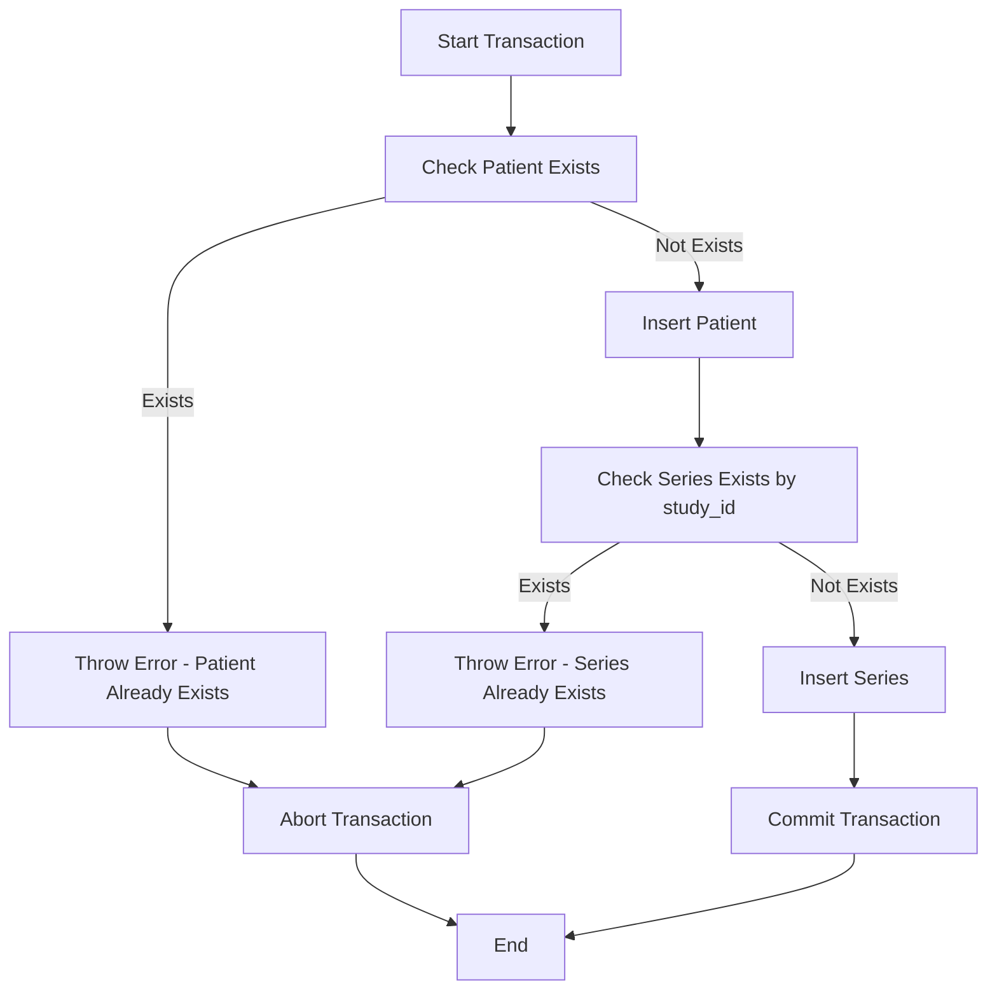

# MongoDB Transaction Case Study: Patient and Series Insertion

## Overview

This case study demonstrates a MongoDB multi-document transaction that ensures atomicity when inserting related patient and series records into a medical imaging database system. Using Mongosh to test code.

## Database Schema

### Collections Involved

1. **patient** - Stores patient information

2. **series** - Stores medical imaging series information

3. **image** - Referenced but not used in this transaction

## Transaction Purpose

The `InsertPatientAndSeries` function performs an atomic insertion of:

1. A new patient record
2. A new series record linked to that patient

This ensures referential integrity between the patient and series collections, preventing orphaned records if either insertion fails.

## Transaction Configuration

### Session Settings

```javascript
session = db.getMongo().startSession({
  readPreference: { mode: "primary" },
});
```

- **Read Preference**: `primary` - All reads are directed to the primary replica set member for strong consistency

### Transaction Options

```javascript
session.startTransaction({
  readConcern: { level: "local" },
  writeConcern: { w: "majority" },
});
```

- **Read Concern**: `local` - Reads the most recent data available on the node (no guarantee of durability)
- **Write Concern**: `majority` - Writes must be acknowledged by majority of replica set members before commit

## Transaction Flow

### Step-by-Step Execution



### 1. Patient Validation and Insertion

```javascript
patient = coll1.findOne({ patient_id: patient_id });
if (patient) {
  throw new Error("Patient already exists");
}
coll1.insertOne({ patient_id: patient_id, weight: weight });
```

- Validates that the patient doesn't already exist
- Inserts the new patient record

### 2. Series Validation and Insertion

```javascript
series = coll2.findOne({ study_id: study_id });
if (series) {
  throw new Error("Series already exists");
}
coll2.insertOne({
  seri_id: seri_id,
  study_id: study_id,
  parent_id: patient_id,
  // ... other fields
});
```

- Validates that the series with the given study_id doesn't exist
- Inserts the new series record with reference to the patient

### 3. Error Handling

```javascript
catch (error) {
  session.abortTransaction();
  throw error;
}
```

- Any error triggers a transaction abort
- All changes are rolled back atomically
- Error is re-thrown for handling at higher levels

### 4. Transaction Commit

```javascript
session.commitTransaction();
```

- If all operations succeed, changes are committed
- Write concern ensures majority acknowledgment

## ACID Properties Demonstration

### Atomicity

- Both insertions succeed together or fail together
- If patient insertion succeeds but series validation fails, patient insertion is rolled back

### Consistency

- Referential integrity maintained between patient and series
- Validation ensures no duplicate patient_id or study_id

### Isolation

- Default isolation level prevents dirty reads
- Other sessions don't see uncommitted changes

### Durability

- Write concern `"majority"` ensures data is persisted to majority of replica set
- Data survives primary node failure

## Test Case Execution

### Provided Test Data

```javascript
InsertPatientAndSeries(
  999, // patient_id
  80.3, // weight (kg)
  99, // seri_id
  "0001_L-SPINE_LSS_20160309_091629_240045" // study_id
);
```

### Expected Outcomes

| Scenario  | Condition                           | Result                | Rollback Occurs        |
| --------- | ----------------------------------- | --------------------- | ---------------------- |
| Success   | Patient & Series don't exist        | Both records inserted | No                     |
| Failure 1 | Patient already exists              | No records inserted   | Yes (on patient check) |
| Failure 2 | Patient new, Series study_id exists | No records inserted   | Yes (on series check)  |
| Failure 3 | Network/DB error                    | No records inserted   | Yes (on exception)     |

## Potential Issues and Improvements

### Current Implementation Issues

1. **Race Condition Risk**

   - Check-then-insert pattern has a small race condition window
   - Another transaction could insert between check and insert
   - **Solution**: Use unique indexes on `patient_id` and `study_id`

2. **Read Concern Level**

   - `local` read concern may read uncommitted data in some scenarios
   - **Improvement**: Consider using `snapshot` for stronger consistency

3. **Error Messages**
   - Generic error messages don't distinguish between validation and system errors
   - **Improvement**: Use custom error types or codes

## Performance Considerations

### Transaction Overhead

- Transactions add latency compared to single operations
- Network roundtrips for commit coordination
- Lock contention with concurrent transactions

### Optimization Strategies

1. Keep transactions short
2. Minimize data read/written in transaction
3. Use appropriate read/write concerns based on requirements
4. Consider batch operations if inserting multiple records

## Use Cases

### When to Use This Pattern

✅ Inserting parent-child records that must maintain referential integrity  
✅ Medical/healthcare applications where data consistency is critical  
✅ Multi-step operations that must be atomic  
✅ Preventing orphaned records in related collections

### When Not to Use

❌ Single document operations (use regular insert with unique index)  
❌ Operations that can tolerate eventual consistency  
❌ High-throughput scenarios where transaction overhead is prohibitive  
❌ Long-running operations (transactions have time limits)

## Conclusion

This transaction implementation demonstrates proper use of MongoDB multi-document transactions for maintaining data integrity in a medical imaging system. The pattern ensures that patient and series records are always inserted atomically, preventing data inconsistencies.

**Key Takeaways:**

- Transactions provide ACID guarantees in MongoDB
- Proper error handling ensures rollback on failures
- Write concern ensures durability across replica set
- Consider using unique indexes to complement transaction logic
- Balance consistency requirements with performance needs

## References

- [MongoDB Transactions Documentation](https://docs.mongodb.com/manual/core/transactions/)
- [MongoDB Read Concern](https://docs.mongodb.com/manual/reference/read-concern/)
- [MongoDB Write Concern](https://docs.mongodb.com/manual/reference/write-concern/)
- [ACID Properties in MongoDB](https://docs.mongodb.com/manual/core/transactions/#transactions-and-atomicity)
